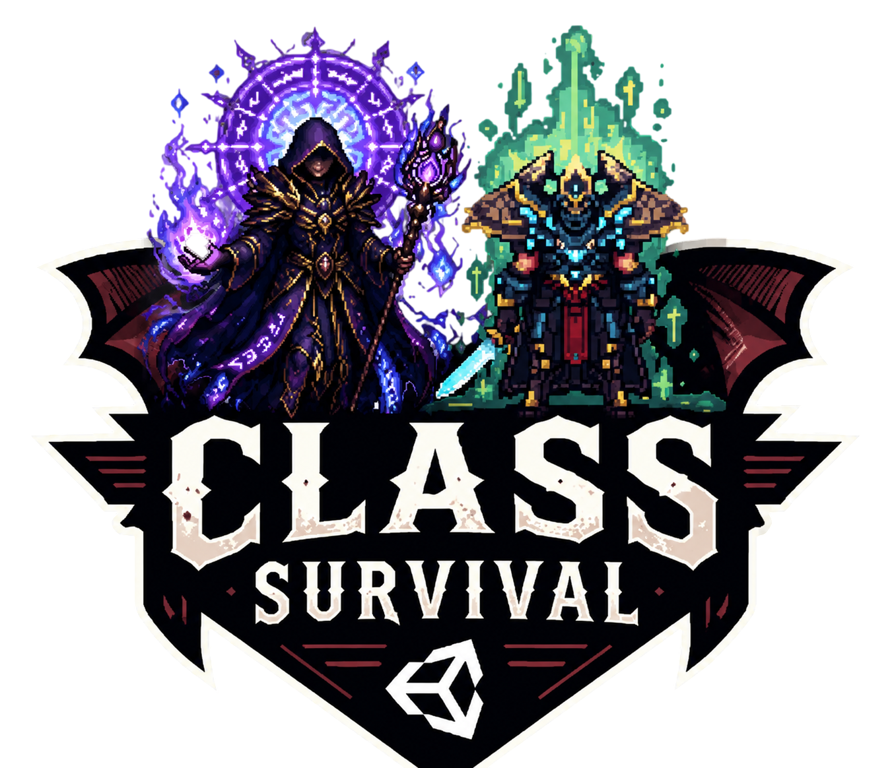
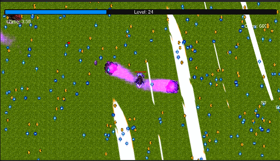
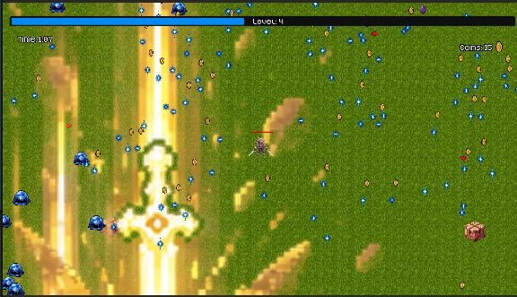

# Class Survival



**Class Survival là một tựa game nhập vai sinh tồn arcade 2D được xây dựng bằng Unity. Trò chơi được phát triển dựa trên nền tảng lối chơi của Vampire Survivors nhưng kết hợp thêm hệ thống tiến hóa theo hệ phái (Class). Người chơi sẽ bắt đầu với một nhân vật cơ bản và một con Dao găm (Dagger), sau đó gia tăng sức mạnh bằng cách chọn Hệ phái, mở khóa các vũ khí đặc trưng và nâng bậc (Promote) hệ phái lên các dạng mạnh mẽ hơn.

## Hệ thống Tiến hóa

### Cách thức hoạt động

- **Bắt đầu**: Khởi đầu với một nhân vật cơ bản sở hữu một con Dao găm.
- **Lên cấp lần đầu**: Chọn Hệ phái đầu tiên của bạn (Chiến binh - Warrior, Pháp sư - Mage, hoặc Cung thủ - Ranger).
- **Các lần lên cấp tiếp theo**: Lựa chọn các vũ khí thuộc về Hệ phái đang kích hoạt của bạn.
- **Nâng bậc**: Khi tất cả vũ khí của một Hệ phái đã đạt cấp tối đa, bạn có thể Nâng bậc hệ phái đó lên một cấp độ (Tier) cao hơn và mạnh hơn.


### Available Classes

| Class   | Weapons | Promotion |
|---------|---------|-----------|
| Warrior | Blade weapons (2-3) | Blade Master |
| Mage    | Magic spells (2-3) | Arch Mage |

## Table of Contents

- [Hướng dẫn Bắt đầu](#getting-started)
  - [Điều kiện tiên quyết](#prerequisites)
  - [Cài đặt](#installation)
- [Trải nghiệm Trò chơi](#playing-the-game)
  - [Phím điều khiển](#controls)
  - [Tổng quan Lối chơi](#gameplay-overview)
- [Phát triển Dự án](#development)
  - [Cấu trúc Thư mục](#project-structure)
- [Bản quyền](#license)
- [Liên hệ](#contact)

## Hướng dẫn Bắt đầu

Các hướng dẫn dưới đây sẽ giúp bạn tải một bản sao của dự án và khởi chạy trên máy cục bộ nhằm phục vụ cho mục đích phát triển và thử nghiệm.

### Điều kiện tiên quyết

Các phần mềm bạn cần cài đặt và cách cài đặt chúng:
```bash
Unity Editor (2021.3 LTS or newer)
Git
```

### Cài đặt

Các bước tuần tự để thiết lập môi trường phát triển:
1. Clone the repository:
   ```bash
   git clone https://github.com/2312765-spec/Class-Survival.git
   ```
2. Mở **Unity Hub** và thêm thư mục dự án vừa clone về..
3. Chọn đúng phiên bản Unity phù hợp và mở dự án.
4. Mở scene **Main** và nhấn nút **Play** để chạy thử.

## Thiết lập Hệ phái trong Editor

Sau khi mở dự án trong Unity:

1. Tìm thành phần (component) `ClassManager` trong scene (hoặc thêm nó vào đối tượng `GameManager`).
2. Trong cửa sổ **Inspector**, kéo thả các tài nguyên `ClassData` từ thư mục `Assets/Classes/` vào danh sách **All Classes**:
   - `Warrior.asset`
   - `Mage.asset`
  
3. Với mỗi tài nguyên `ClassData`, hãy gán các vũ khí tương ứng (các thành phần Weapon từ scene).
4. (Tùy chọn) Gán các liên kết cho việc nâng bậc hệ phái (Ví dụ: *Warrior* $\rightarrow$ *WarriorTier2*).

## Trải nghiệm Trò chơi

### Phím điều khiển

- **Phím mũi tên / WASD:** Di chuyển nhân vật.
- **Chuột:** Lựa chọn nâng cấp mỗi khi lên cấp.
- **Escape:** Tạm dừng trò chơi.

### Tổng quan Lối chơi

Cố gắng sinh tồn càng lâu càng tốt bằng cách đánh bại các làn sóng kẻ thù. Mỗi khi lên cấp, bạn có thể chọn:
- Một Hệ phái mới (nếu bạn chưa chọn, hoặc thông qua tỷ lệ hiếm xuất hiện).
- Mở khóa hoặc nâng cấp một vũ khí thuộc Hệ phái.
- Nâng bậc Hệ phái (khi tất cả vũ khí của hệ phái đó đã đạt cấp tối đa).

Thu thập các hạt kinh nghiệm để lên cấp, nhặt tiền xu để mua các nâng cấp chỉ số, và giữ mạng sống!



## Phát triển Dự án

### Cấu trúc Thư mục

Dự án tuân theo cấu trúc dưới đây để đảm bảo việc tìm kiếm và phát triển dễ dàng:
- **Assets/**
  - **Animations/**: Chứa tất cả các hiệu ứng hoạt ảnh trong game.
  - **Classes/**: Các tài nguyên ScriptableObject của ClassData (Warrior, Mage, Ranger, v.v.).etc.).
  - **Prefabs/**: Các đối tượng Prefab của kẻ địch và vật phẩm nhặt được.
  - **Scenes/**: Các màn chơi Unity bao gồm màn chơi chính và menu.
  - **Scripts/**: Các mã nguồn quản lý logic game.
    - `ClassData.cs` — ScriptableObject định nghĩa một hệ phái (tên, vũ khí, nâng bậc).
    - `ClassManager.cs` — Bộ quản lý tiến trình hệ phái của người chơi khi runtime.
    - `ExperienceLevelController.cs` — Logic lên cấp tích hợp với hệ thống hệ phái.
    - `LevelUpSellectionButton.cs` — Nút bấm UI hỗ trợ chọn hệ phái/vũ khí/nâng bậc.



## License

Dự án này được cấp phép theo các điều khoản của MIT License - xem tệp LICENSE.md để biết thêm chi tiết.

## Contact & Credits

- **Developers (Current Fork):** Nguyen Van Thuan, Mai Van Quang, Nguyen Huu Trung Son
- **Project Link:** https://github.com/2312765-spec/Class-Survival
- **Original Project:** Forked and developed from the original repository by VampAK1864 https://github.com/VampAK1864/Vampire-Survivors
